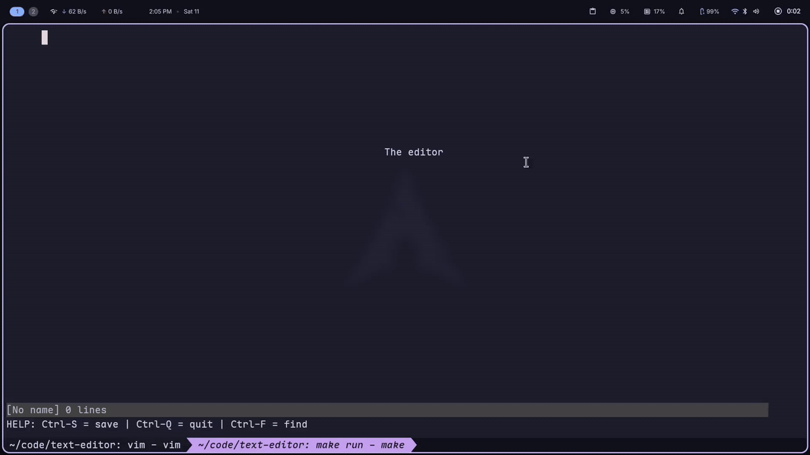

# text-editor

A terminal text editor built from scratch in C++ with no external libraries.



## Features

- Open, edit, and save files
- Keyboard navigation — arrow keys, Page Up/Down, Home/End
- Incremental search (Ctrl-F) with multiple matches per line, forward/backward cycling, and wrap-around
- Line numbers
- Warns you before discarding unsaved changes

## Build

Needs a C++ compiler (the makefile uses `g++`).

```bash
make
```

The binary is `build/main`.

## Run

```bash
./build/main
```

Pass a file path to open it directly.

```bash
./build/main path/to/file.txt
```

## Keys

- **Ctrl-S** — save
- **Ctrl-F** — find
- **Ctrl-Q** — quit (will ask to confirm if you have unsaved changes)

## Clean

```bash
make clean
```
